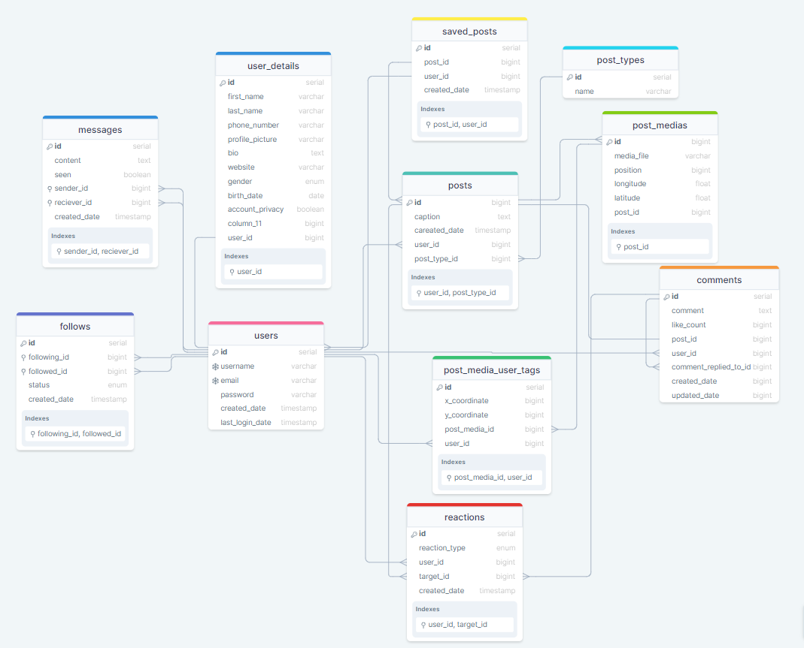

# Social Media Platform Database

This database schema is designed to support a social media platform resembling Instagram. It includes tables for users, user details, follow relationships, messages, posts, comments, reactions, saved posts, and likes.

https://drawsql.app/teams/dias-3/diagrams/social-media

## Tables Description

### 1. users

Stores user account information including username, email, and password.

### 2. user_details

Stores additional user profile information such as first name, last name, and profile picture.

### 3. follows

Manages user follow relationships with fields like following_user_id, followed_user_id, and status.

### 4. messages

Stores messages between users with sender_id, receiver_id, content, etc.

### 5. post_types

Defines types of posts like 'story', 'profile', etc.

### 6. posts

Stores post information including caption, post_type_id, user_id, etc.

### 7. post_medias

Stores media files related to posts with fields like media_file, position, longitude, latitude, etc.

### 8. post_media_user_tags

Stores user tags on media files with x_coordinate, y_coordinate, post_media_id, user_id, etc.

### 9. saved_posts

Manages saved posts by users with post_id, user_id, created_date, etc.

### 10. comments

Stores comments on posts with comment text, like_count, post_id, user_id, etc.

### 11. content_activity

Manages the number of likes that a post or comment has.

### 13. likes_entity

Parent table for likes with common fields like user_id, entity_id, and created_date.

### 14. post_likes

Stores likes on posts, inherits from likes_entity with additional constraints.

### 15. comment_likes

Stores likes on comments, inherits from likes_entity with additional constraints.

## Relationships Between Tables

1. **Users to User_details:**

   - Each user has only one set of user details (first name, last name, etc.), creating a one-to-one relationship

2. **Users to Followers/Following (Follows Table):**

   - Many-to-many relationship where a user can follow multiple users and be followed by multiple users.

3. **Users to Messages (Sender and Receiver):**

   - One-to-many relationship where a user can send multiple messages, but each message has one sender and one receiver.

4. **Users to Posts:**

   - One-to-many relationship where a user can create multiple posts, but each post has one user as the creator.

5. **Users to Saved_posts:**

   - One-to-many relationship where each user can have multiple saved posts (favorites or collections), but each saved post belongs to only one user.

6. **Posts to Post Media:**

   - One-to-many relationship where a post can have multiple media files associated with it.

7. **Posts to Post Media User Tags (Post_Media_User_Tag Table):**

   - Many-to-many relationship where multiple users can be tagged in multiple posts, and one post can have multiple users tagged in it.

8. **Users to Comments:**

   - One-to-many relationship where a user can comment on multiple posts, but each comment has one user as the author.

9. **Posts to Saved Posts (indirectly):**

   - Many-to-one. Each post can have multiple instances of being saved by different users, but each instance of saved post belongs to only one post. This relationship indirectly contributes to the many-to-many relationship between users and posts facilitated by the saved_posts junction table.

10. **Posts to Comments**

    - One-to-many relationship where a post can have multiple comments, but each comment belongs to only one post.

11. **Posts/Comments to Content Activity**:

    - One-to-one relationship where a post or a comment is associated with its like count.

12. **Posts to Post_likes:**

    - One-to-many relationship where each post can have multiple likes, but each like belongs to only one post.

13. **Comments to Comment_likes:**

    - One-to-many relationship where each comment can have multiple likes, but each like belongs to only one comment.

14. **Likes_Entity to Comment_likes/Post_likes:**
    - One-to-one relationship where each record in `comment_likes` or `post_likes` corresponds directly to a record in `likes_entity`.
